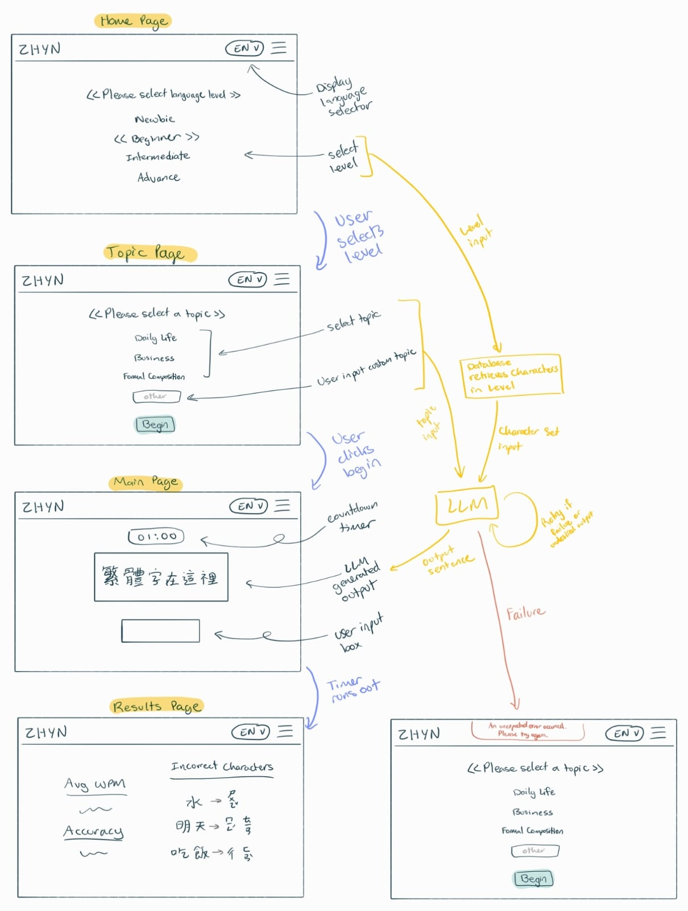

# Assigment 3: An AI-Augmented Concept

## Augment Design

[Original and AI-augmented version](zhyn-llm.spec) (My original concept specification from Assignment 2 already includes AI-augmentation)

## User Interaction

### User Journey

**Problem**: User is an advanced Mandarin foreign language learner. User learned Mandarin in the States but is now studying at a Mandarin Training Center in Taiwan. User would like to switch to using Zhuyin input method, as it is the standard in Taiwan.

**Context**: User is not used to typing Zhuyin, they take a long time to type each word. The user wants to improve speed through typing practice.

**Goal**: The user wants to practice typing Zhuyin and receive immediate feedback on whether they typed correctly or not.

**Specific actions**:

Action 1: User selects "advance" level

- User is brought to Topic Page

Action 2: User types in "Narrative Writing" into "other" topic input box and clicks "Begin".

- User is brought to Main Typing Page; the target typing text displayed is the LLM generated output - a set of sentences using Advance Level Characters in the form of narrative writing.
- Timer starts for 1 minute

Action 3: User starts typing the characters they see on screen

- User receives feedback when they type incorrectly (inccorectly typed character is highlighted red, correctly typed green, not yet typed gray)

Action 4: Timer runs out

- User is brought to Results Page, telling them their speed, accuracy, and a list of inccorectly types characters, and what the correct Zhuyin representation is

**Outcome**: User was able to practice typing Chinese characters suitable to their level and topic of choice, and receives feedback and metrics on their typing performance. User can repeat this typing practice to drill their typing skills.

## Concept Implementation

## Explore richer test cases and prompts

## Validators
